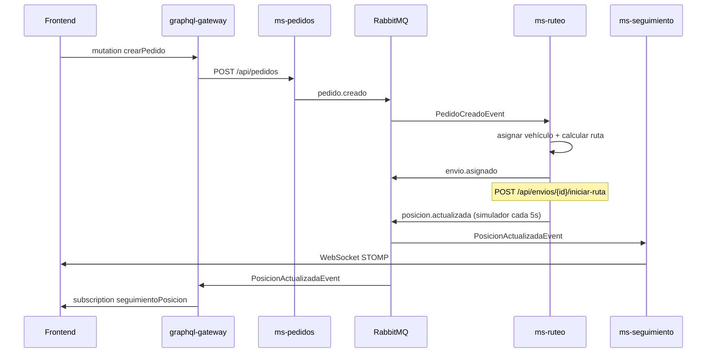

# LogiFlow — Fase 2: Arquitectura y flujos de eventos

## Mapa de microservicios

| Servicio | Puerto | API | Base de datos |
|----------|--------|-----|---------------|
| ms-flota-rest | 8081 | REST + Swagger | logiflow_flota |
| ms-taller-rest | 8082 | REST + Swagger | logiflow_taller |
| ms-auth | 8083 | REST (`/login`, `/verify`, `/api/auth/*`) | logiflow_auth |
| ms-clientes | 8084 | REST + Swagger | logiflow_clientes |
| ms-pedidos | 8085 | REST + Swagger | logiflow_pedidos |
| ms-ruteo | 8086 | REST + Swagger | logiflow_ruteo |
| ms-seguimiento | 8087 | WebSockets (STOMP) | — |
| graphql-gateway | 8088 | GraphQL (+ subscriptions) | — |

Infraestructura compartida: **PostgreSQL** (host `5433`) y **RabbitMQ** (AMQP `5672`, UI `15672`).

## Diagrama de componentes

```mermaid
flowchart TB
    FE[Frontend]
    GW[graphql-gateway :8088]
    AUTH[ms-auth :8083]
    CLI[ms-clientes :8084]
    PED[ms-pedidos :8085]
    RUT[ms-ruteo :8086]
    SEG[ms-seguimiento :8087]
    FLO[ms-flota-rest :8081]
    RMQ[(RabbitMQ topic\nlogiflow.events)]
    PG[(PostgreSQL)]

    FE --> GW
    FE --> AUTH
    FE --> CLI
    FE --> SEG

    GW -->|REST| PED
    GW -->|REST| RUT
    GW -->|consume posicion| RMQ

    PED -->|PedidoCreado / PedidoCancelado| RMQ
    RUT -->|consume pedidos| RMQ
    RUT -->|EnvioAsignado / PosicionActualizada| RMQ
    RMQ -->|posicion.actualizada| SEG
    SEG -->|STOMP /topic/seguimiento/{codigo}| FE

    RUT -->|REST| FLO
    RUT -->|REST| PED

    PED --> PG
    RUT --> PG
    CLI --> PG
    AUTH --> PG
    FLO --> PG
```

## Flujo de eventos RabbitMQ

Exchange topic: `logiflow.events`

| Routing key | Productor | Consumidor(es) |
|-------------|-----------|----------------|
| `pedido.creado` | ms-pedidos | ms-ruteo |
| `pedido.cancelado` | ms-pedidos | ms-ruteo |
| `envio.asignado` | ms-ruteo | (extensible) |
| `posicion.actualizada` | ms-ruteo (simulador) | ms-seguimiento, graphql-gateway |



## Arranque local

```bash
docker compose up -d
mvn -pl ms-flota-rest,ms-pedidos,ms-ruteo,ms-seguimiento,graphql-gateway -am spring-boot:run
```

Credenciales demo auth: `admin` / `admin123`.

GraphiQL: http://localhost:8088/graphiql

RabbitMQ Management: http://localhost:15672 (logiflow / logiflow)
